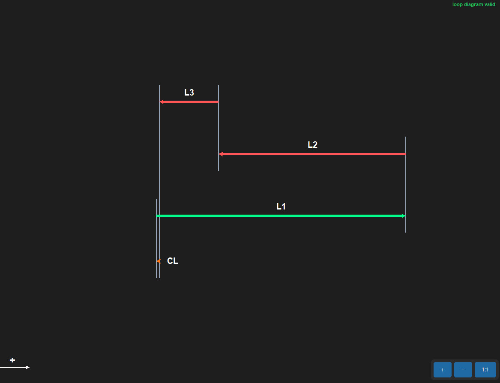
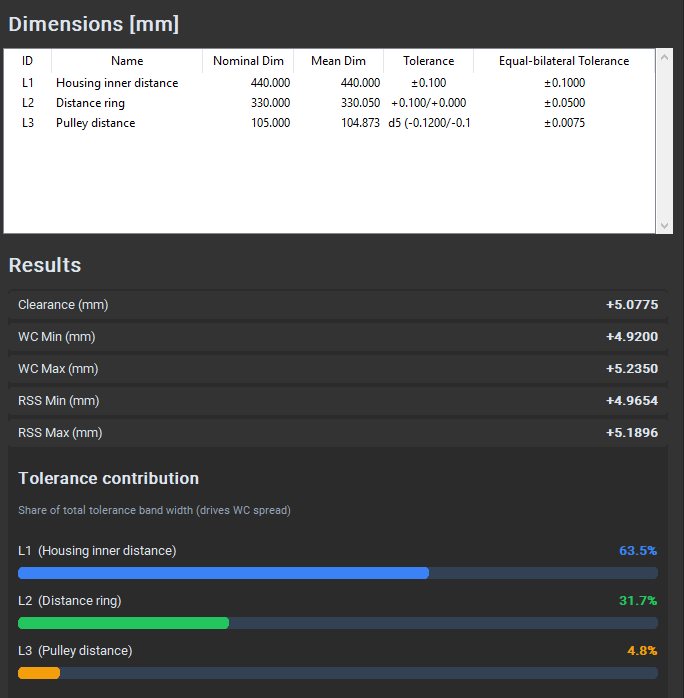
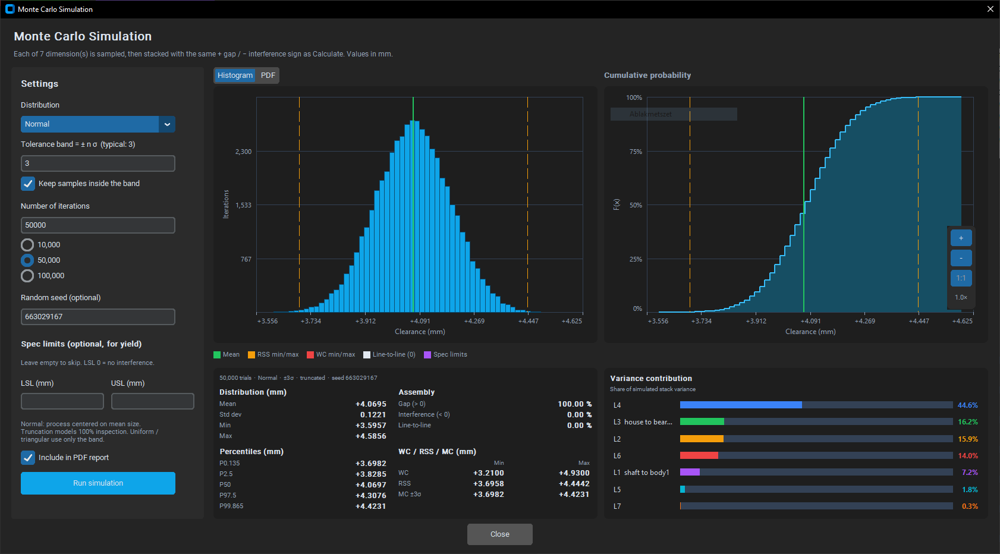

# EasyStackup

Desktop app for **1D mechanical tolerance stack-up** analysis.

Draw a closed dimension loop on a canvas, assign tolerances (symmetric, bilateral, or ISO fits), then evaluate **worst-case (WC)**, **RSS**, and **Monte Carlo** clearance or interference. Export a PDF report and loop diagrams (PNG/SVG).

**Version:** 0.2.0  
**License:** [MIT](LICENSE)  
**Repository:** [github.com/robertdosa/EasyStackup](https://github.com/robertdosa/EasyStackup)

## Screenshots








---

## Features

- Interactive **loop diagram** (draw-to-scale dimension arrows); opening a project **fits and centers** the loop
- **Close loop / clearance** dimension with sign convention: `+` gap, `−` interference
- Tolerance types:
  - Symmetric ±
  - Bilateral upper/lower
  - ISO 286 hole/shaft fits (subset of common designations)
- Stack results: **mean clearance**, **WC min/max**, **RSS min/max**
- **Monte Carlo simulation** of the closed loop (histogram, PDF, CDF, percentiles, optional yield)
- **Tolerance contribution** bars (share of total band width)
- Display units: **mm** or **inch** (values stored as mm)
- Save / load projects (`.eysp` JSON), including the last WC/RSS and Monte Carlo snapshots — **Ctrl+S** to save
- Export:
  - Multi-page **PDF report** (optional Monte Carlo section)
  - Loop diagram **PNG** / **SVG**
- Unsaved-change prompts and dirty-state title (`*`)

---

## Requirements

- **Python 3.10+** (developed with 3.14)
- **tkinter** (usually included with Python on Windows; on some Linux installs you may need `python3-tk`)
- Windows recommended (CustomTkinter desktop UI)
- Dependencies listed in [`requirements.txt`](requirements.txt):
  - `customtkinter`
  - `Pillow`
  - `reportlab`

---

## Install & run

```bash
# Clone
git clone https://github.com/robertdosa/EasyStackup.git
cd EasyStackup

# Virtual environment (Windows)
python -m venv venv
venv\Scripts\activate

# Dependencies
python -m pip install -r requirements.txt

# Launch (from the project root so core/ and ui/ import correctly)
python main.py
```

On macOS/Linux:

```bash
python3 -m venv venv
source venv/bin/activate
python -m pip install -r requirements.txt
python main.py
```

UI is primarily tested on Windows.

---

## Quick start

1. **New project** from the main menu.
2. Click near the starting face and **drag** to place the first dimension; enter nominal and tolerance.
3. Continue the chain from the active face.
4. Click **Close Loop / Add Clearance** when the stack is complete.
5. Click **Calculate** to show WC / RSS results and contributions.
6. **File → Save** or **Ctrl+S** (`.eysp`).
7. **Simulation → Monte Carlo Simulation** to sample the closed loop statistically.
8. **Export → Export PDF report** for a multi-page report (Monte Carlo pages are included when the dialog checkbox is on and a run exists).

---

## Monte Carlo simulation

Requires a **closed loop** (same as Calculate / PDF export). Open **Simulation → Monte Carlo Simulation**, set the options, then **Run simulation**.

Each contributing dimension is sampled, then stacked with the same sign convention as Calculate: `+` gap, `−` interference.

**Distribution**

| Option | Meaning |
| --- | --- |
| **Normal** (default) | Process centered on mean size. The tolerance band is treated as ±*n*σ (typical *n* = 3). |
| **Uniform** | Every size in the band is equally likely. |
| **Triangular** | Peak at mean size, density zero at the band edges. |

For Normal, **Keep samples inside the band** (on by default) rejects draws outside the drawing limits — a 100% inspection model. Turn it off to allow process tails beyond the limits (the stack can then exceed worst-case).

**Iterations** — type a count (1,000–500,000) or pick a preset (10,000 / 50,000 / 100,000). Optional **seed** for a repeatable run. Spec limits are optional: LSL / USL in the current display unit. Leave them empty to skip yield; **LSL 0** means “no interference.”

**Plots** — Histogram (iteration counts) or PDF (density) on the left, CDF on the right. Scroll to zoom, drag to pan; **＋ / − / 1:1** on the CDF. Mean, RSS, WC, line-to-line (0), and spec overlays are drawn when they fall in range.

**Include in PDF report** is on by default. Uncheck it to keep Monte Carlo out of **Export → Export PDF report**. The PDF section is added only when this box is checked **and** a run has been stored.

**Results**

- Histogram / PDF / CDF of simulated clearance
- Mean, standard deviation, min/max, and percentiles (including P0.135 / P99.865 ≈ ±3σ of a normal)
- Predicted **gap** vs **interference** rates
- Yield vs LSL/USL when spec limits are set
- Side-by-side **WC / RSS / MC** comparison
- **Variance contribution** per dimension (share of simulated stack variance)

The last run (settings, histogram, stats) is stored in the `.eysp` file and restored when you reopen the project or the dialog. Editing the loop clears stored WC/RSS and Monte Carlo results so they cannot go stale.

Truncated-normal Monte Carlo is typically a little tighter than RSS; uniform is typically wider. WC remains the hard geometric envelope when samples stay inside the bands.

---

## Project layout

```text
EasyStackup/
├── main.py              # Entry point (menu shell + workspace)
├── requirements.txt
├── LICENSE
├── README.md
├── .gitignore
├── assets/              # App icon (PNG + ICO)
├── docs/                # README screenshots
├── core/                # Model, calculator, Monte Carlo, ISO tables, I/O, PDF
├── ui/                  # CustomTkinter dialogs and canvas app
└── tests/               # Unit tests (unittest)
```

---

## Tests

From the project root (venv active):

```bash
python -m unittest discover -s tests
```

---

## Project files (`.eysp`)

Projects are JSON. Dimensions are stored in **millimetres**; the display unit is a preference only. The file also stores:

- Layout metadata (diagram origin face)
- Last **Calculate** snapshot (WC / RSS / contributions), when present
- Last **Monte Carlo** snapshot (settings, histogram, stats), when present
- Whether to **include Monte Carlo in the PDF report** (default: yes)

Opening a saved loop **centers it on the canvas and zooms to fit**.

---

## Building a Windows executable (optional)

A standalone `.exe` is **not** required to use the source. When you want a Release build, from the **project root** (with your venv active):

```bash
python -m pip install pyinstaller
python -m PyInstaller --noconfirm --clean --windowed --onedir --name EasyStackup --icon assets/app_icon.ico --add-data "assets;assets" main.py
```

- Output is under `dist/EasyStackup/`. Zip that folder for GitHub Releases.
- `--add-data "assets;assets"` is the **Windows** form (`source;dest`). On Linux/macOS use `assets:assets`.
- Windows may SmartScreen-block unsigned binaries — expected for hobby/unsigned builds.

---

## Known limitations (v0.2)

- **1D** stack-ups only (single closed loop)
- Clearance (CL) is a special closing dimension (not fully edited like L-dimensions)
- ISO fit table is a **practical subset**, not the full standard
- Monte Carlo uses assumed distributions (not measured process data); results vary slightly with trial count and seed
- Desktop GUI; packaging/signing and multi-OS builds are optional follow-ups

---

## Disclaimer

EasyStackup is a calculation and documentation aid. Results depend on how the loop and tolerances are defined. **The engineer remains responsible** for interpretation, design decisions, and any use in production or safety-related work.

---

## License

This project is released under the **MIT License**. See [LICENSE](LICENSE) for the full text.

---

## Development notes

Developed with AI assistance. Design decisions, engineering logic, and final review remain the responsibility of the author.
